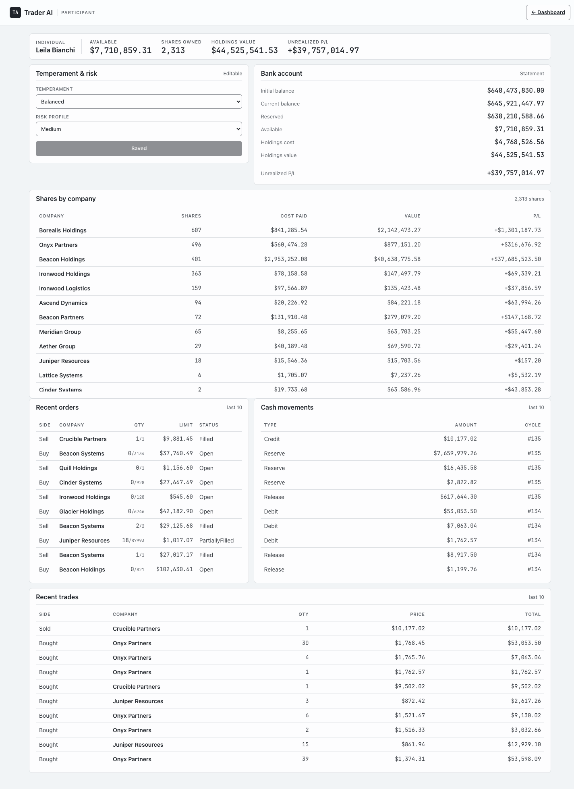
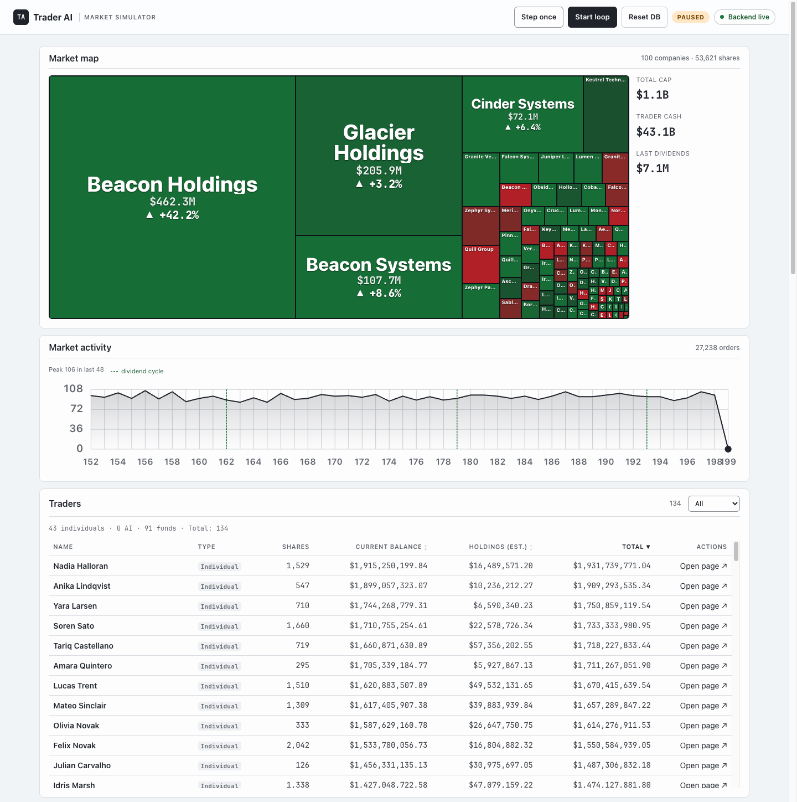
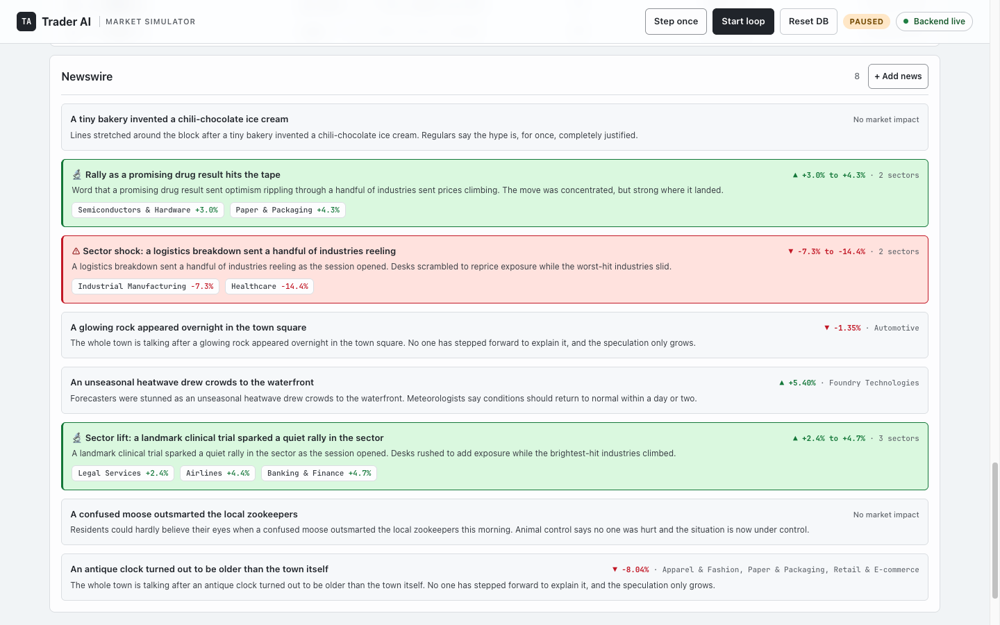
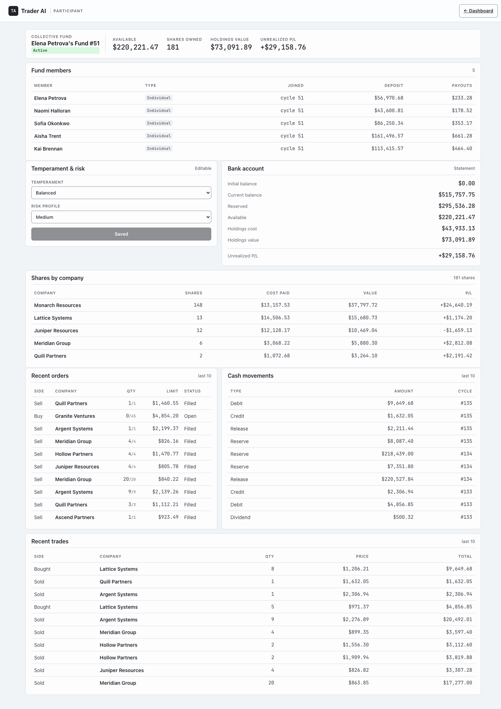

# Trader Simulator

## How to launch

```bash
./start-dev.sh
```

The script will ensure the .NET SDK is installed, Node.js and npm, and then restore the project dependencies. The only thing you have to do - install the [.NET Sdk for you OS](https://dotnet.microsoft.com/download).

## Website

The frontend runs at `http://localhost:5173`. The backend runs at `http://localhost:5100`.

Each trader has a detail block on the Traders page at `/traders?trader=<id>` — temperament and risk profile (editable), bank balances, holdings valued against current prices, and recent orders, trades, and cash movements. Open it from the Traders table on the dashboard.



The dashboard's market map is sized by company capitalisation, with the two most recent headlines beneath it. The News page collects the full feed of events the running market publishes on a cycle schedule — some of which nudge a company's or an industry's share price — and is where you can add a news event by hand, choosing the target company or industries, a theme, and the impact direction and size. A separate Trade market page pairs the same market map with an orders-per-cycle activity chart.



The market can also be hit by a crisis — a random shock, growing more likely the longer the market runs without one, that drives a few sectors (local) or a large share of all sectors (global) sharply down. A banner highlights a recent crisis and it appears in the Newswire as an alert. A sharp drop, from a crisis or a news event, also cancels the standing buy orders for the affected companies, just as a sharp rise cancels their standing sell orders. The upbeat counterpart is a science investigation — a small, local breakthrough that lifts a few sectors, shown with its own green banner and Newswire items, and which only nudges prices up without touching the order book. A trader whose share holdings grow very valuable can also go bankrupt: its cash is wiped and most of its holdings are dumped onto the market at a steepening discount until they sell, an event that shows up in the Newswire without moving any other prices.



Cash-strapped traders may instead pool into a collective fund, which trades as its own participant and is tagged with a green label in the Traders table. A member contributes most of its cash, stops bidding on its own, and earns a share of the fund's dividends; the fund returns that deposit when the member leaves, and once only two members remain and one departs it sells out and splits the proceeds between them. A member drops out of the Traders table while it belongs to a fund and returns once it leaves or the fund closes. A fund's page lists who has joined and when.



Traders that run out of road eventually leave the market for good, keeping it churning rather than filling up with stuck, broke participants. A fund that sits unable to trade for long enough unwinds on its own; a trader left with no shares and no cash to buy any may quit after a long drought, its odds climbing the longer it stays stuck; and a fund member handed back only a fraction of what it put in gets one chance to walk away. While a crisis is active these traders bail faster — a global crisis makes each of them far likelier to quit that cycle, a local one somewhat likelier. Every departure is filled by a fresh replacement with a new random balance, so the market holds its size. A left sidebar organises the pages into an **Active market** group (traders, companies, industries, news, crises, auditors, banks, bank loans) and an **Inactive market** group holding the archives — Closed companies, Departed traders, and Closed funds. The Departed traders page at `/departed-traders` archives everyone who has left with their reason for leaving, the cycles they joined and left, how many orders they placed, and how their final balance ended up against where they started.

You can also step into the market yourself. Join as a human player and you are handed a random starting balance, then trade by hand under the same rules as everyone else — your buy and sell orders reserve cash and match just like theirs, and you collect dividends on the shares you hold. The difference is that the market does not manage your orders day to day: they are never re-priced, never cancelled for resting too long, and never swept away by a crisis or a news event, so you cancel the ones you no longer want yourself. Stock splits and reverse merges still cancel participant orders so the book can reform at the adjusted price. A player never goes bankrupt and never joins a collective fund, and a market holds at most one player at a time. A player panel on the dashboard shows your balances and how your cash and total worth have changed over the last cycle and overall, then a row of tabs for your active assets, the companies you hold that need attention, your open orders to cancel, a chart of your total worth over time, your cash movements, and your bank loans. A dedicated Player stats page in the sidebar opens your full participant view — the same deep page every automated trader has. You place orders from a company's own view.

No authentication is required between the frontend and backend for local development.

## Documentation

| Page | What it covers |
| --- | --- |
| [Architecture](docs/architecture.md) | The system boundaries and durable patterns connecting the frontend, market cycle, trading, lifecycle, and persistence subsystems. |
| [Domain](docs/domain.md) | The simulation's data model and the core market rules. |
| [Participant rules](docs/participant-rules.md) | Shared participant rules and links to each role page. |
| [Individual](docs/roles/individual.md) | Rules for the default automated trader. |
| [AI Agent](docs/roles/ai-agent.md) | Rules for agent-style automated traders. |
| [Player](docs/roles/player.md) | Rules for the human-controlled trader. |
| [Company](docs/roles/company.md) | Rules for issuers and listed assets. |
| [Collective Fund](docs/roles/collective-fund.md) | Rules for pooled fund traders. |
| [Fund Member](docs/roles/fund-member.md) | Rules for traders while they belong to a fund. |
| [Auditors](docs/roles/auditors.md) | Rules for the rating agencies that review companies. |
| [Share price formation](docs/rules/share-price-formation.md) | How company share prices form during each market cycle. |
| [Sector sentiment](docs/logic/sector-sentiment.md) | How sector confidence shapes shocks and automated trading demand. |
| [Free-share emission](docs/logic/free-share-emission.md) | How large companies issue free shares to dilute price. |
| [Bank loans](docs/logic/bank-loans.md) | How buying on margin opens a bank loan that is repaid over time. |

## Tech stack

- .NET 10
- SQLite database
- Web API for backend
- React for frontend
- Some mechanism for trading simulation - code should be able to run in a loop in parallel thread and make decisions based on the market data (to discuss with AI)
